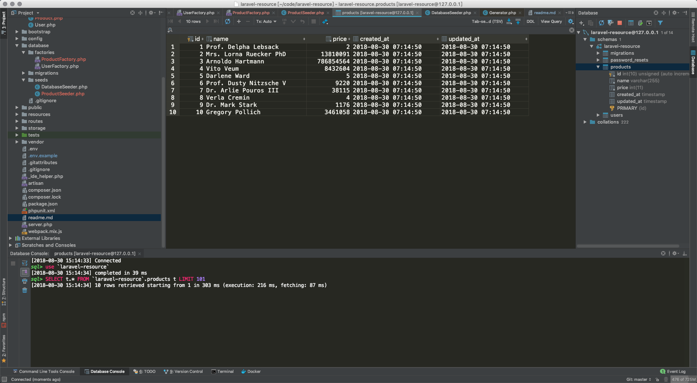

# Laravel Resource

```shell
root@7b2446435c82:/var/www/laravel-resource# php artisan make:model Product -cm
Model created successfully.
Created Migration: 2018_08_30_070408_create_products_table
Controller created successfully.
root@7b2446435c82:/var/www/laravel-resource#
root@7b2446435c82:/var/www/laravel-resource# php artisan migrate
Migration table created successfully.
Migrating: 2014_10_12_000000_create_users_table
Migrated:  2014_10_12_000000_create_users_table
Migrating: 2014_10_12_100000_create_password_resets_table
Migrated:  2014_10_12_100000_create_password_resets_table
Migrating: 2018_08_30_070408_create_products_table
Migrated:  2018_08_30_070408_create_products_table
root@7b2446435c82:/var/www/laravel-resource#
```


```shell
root@7b2446435c82:/var/www/laravel-resource# php artisan make:resource Product
Resource created successfully.
root@7b2446435c82:/var/www/laravel-resource#
```


```shell
root@7b2446435c82:/var/www/laravel-resource# php artisan make:seeder ProductSeeder
Seeder created successfully.
root@7b2446435c82:/var/www/laravel-resource#
```


`/Users/qiuyu/code/laravel-resource/database/factories/ProductFactory.php`

```php
<?php

use Faker\Generator as Faker;

/*
|--------------------------------------------------------------------------
| Model Factories
|--------------------------------------------------------------------------
|
| This directory should contain each of the model factory definitions for
| your application. Factories provide a convenient way to generate new
| model instances for testing / seeding your application's database.
|
*/

$factory->define(App\Product::class, function (Faker $faker) {
    return [
        'name' => $faker->name,
        'price' => $faker->randomNumber(),
    ];
});

```

`/Users/qiuyu/code/laravel-resource/database/seeds/ProductSeeder.php`

```php
<?php

use Illuminate\Database\Seeder;
use App\Product;

class ProductSeeder extends Seeder
{
    /**
     * Run the database seeds.
     *
     * @return void
     */
    public function run()
    {
        factory(Product::class, 10)->create();
    }
}

```


```shell
root@7b2446435c82:/var/www/laravel-resource# php artisan db:seed --class=ProductSeeder
root@7b2446435c82:/var/www/laravel-resource#
```




`/Users/qiuyu/code/laravel-resource/app/Http/Controllers/ProductController.php`

```php
<?php

namespace App\Http\Controllers;

use Illuminate\Http\Request;
use App\Http\Resources\Product as ProductResource;
use App\Product;

/**
 * Class ProductController
 * @package App\Http\Controllers
 */
class ProductController extends Controller
{
    protected $product;

    /**
     * ProductController constructor.
     * @param Product $product
     */
    public function __construct(Product $product)
    {
        $this->product = $product;
    }

    public function show($id)
    {
        return new ProductResource($this->product->find($id));
    }
}
```

`/Users/qiuyu/code/laravel-resource/app/Http/Resources/Product.php`

```php
<?php

namespace App\Http\Resources;

use Illuminate\Http\Resources\Json\Resource;

class Product extends Resource
{
    /**
     * Transform the resource into an array.
     *
     * @param  \Illuminate\Http\Request  $request
     * @return array
     */
    public function toArray($request)
    {
        // return parent::toArray($request);
        return [
            'id' => $this->id,
            'name' => $this->name,
            'price' => $this->price,
            'test' => 'This is a test',
            'created_at' => (string)$this->created_at,
            'updated_at' => (string)$this->updated_at,
        ];
    }

    /**
     * @param \Illuminate\Http\Request $request
     * @return array
     */
    public function with($request)
    {
        return [
            'links' => [
                'self' => url('api/products/' . $this->id),
            ]
        ];
    }
}

```


`/Users/qiuyu/code/laravel-resource/routes/api.php`

```php
<?php

use Illuminate\Http\Request;

/*
|--------------------------------------------------------------------------
| API Routes
|--------------------------------------------------------------------------
|
| Here is where you can register API routes for your application. These
| routes are loaded by the RouteServiceProvider within a group which
| is assigned the "api" middleware group. Enjoy building your API!
|
*/

Route::middleware('auth:api')->get('/user', function (Request $request) {
    return $request->user();
});

Route::get('/products/{id}', 'ProductController@show');

```


